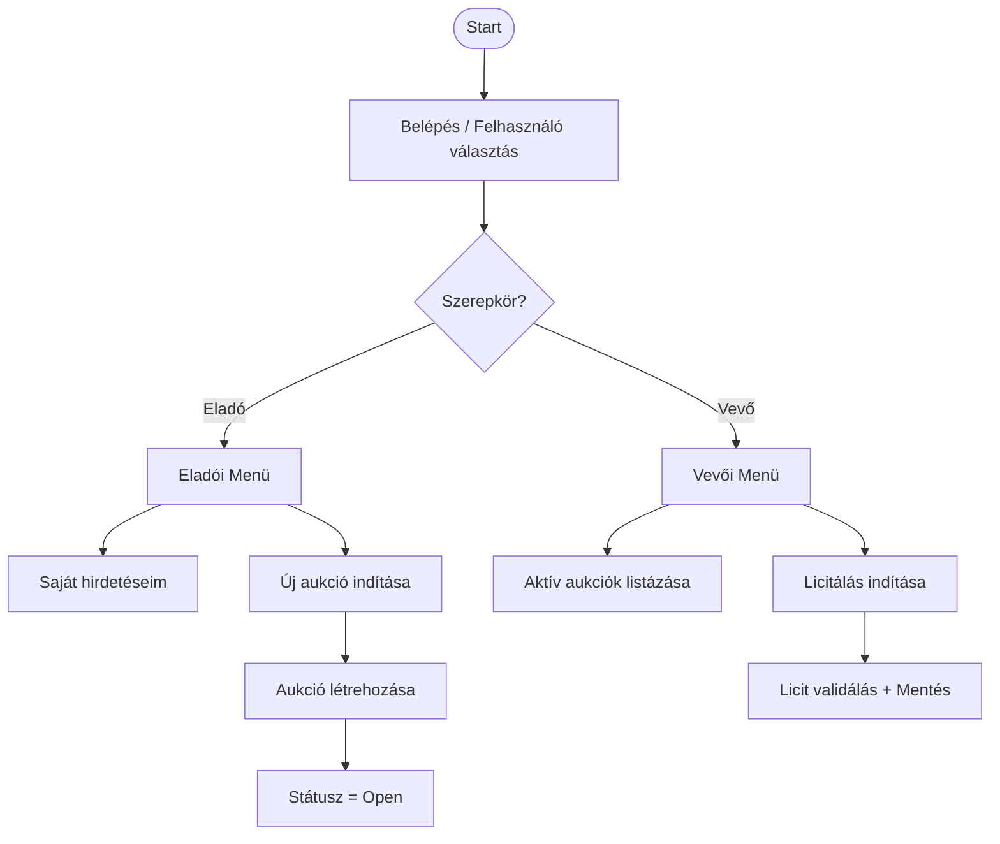

# 🏗 SZEAuction – Console Auction System (.NET + PostgreSQL)

A **SZEAuction** egy .NET 8 alapú konzolos árverési rendszer, amely PostgreSQL adatbázisra épül. A projekt célja egy robusztus licitálási logika megvalósítása, kezelve az egyidejűséget és az automatizált lezárási folyamatokat.

---

## 👨‍💻 Fejlesztési folyamat (Visual Studio)

### 1️⃣ Repository klónozása
1. Nyisd meg a **Visual Studio-t**.
2. Válaszd a **Clone a repository** opciót.
3. Add meg a GitHub repository URL-jét.
4. Kattints a **Clone** gombra.

### 2️⃣ Saját branch használata (Kötelező)
**Soha ne dolgozz közvetlenül a `main` ágon!**
1. Nyisd meg a **Git Changes** panelt.
2. Kattints az aktuális branch nevére -> **New Branch**.
3. Elnevezési konvenció: `feature/funkcio-neve` (pl. `feature/bid-logic`).

### 3️⃣ Commit & Push
1. A módosítások után írj commit üzenetet (pl. `Add validation for bid amounts`).
2. Kattints a **Commit All** gombra.
3. Kattints a **Push** (felfelé mutató nyíl) gombra a szerverre küldéshez.

### 4️⃣ Pull Request (PR)
1. GitHubon kattints a **Compare & pull request** gombra.
2. Ellenőrizd: `base: main` <- `compare: feature/...`.
3. Sikeres jóváhagyás és Merge után Visual Studio-ban válts vissza `main`-re és nyomj egy **Pull**-t.

---

## 🧠 Rendszerlogika (Diagramok)

### 1) Felhasználói folyamatok



### 2) Licitálási folyamat (Szekvencia diagram)
```mermaid
flowchart TD
    W_A[Aukció lezárása] --> W_B[Licitek betöltése]
    W_B --> W_C{Van licit?}
    W_C -->|Nincs| W_D[Státusz=Closed, Nyertes=NULL]
    W_C -->|Van| W_E[Rendezés: Összeg DESC, Idő ASC, ID ASC]
    W_E --> W_F[Első rekord = Nyertes]
    W_F --> W_G[Update: auction_items (state, winning_bid_id)]
    W_G --> W_H[Értesítések létrehozása]
```
### 3) Aukció lezárása (Tie-break szabályok)
Ha az aukció lejár, a rendszer az alábbi prioritások szerint választ nyertest:
1. Legmagasabb összeg (Amount DESC).
2. Időrend (Aki előbb tette meg ugyanazt az összeget - CreatedAt ASC).
3. ID (Végső döntő - Id ASC)
    
```mermaid
flowchart TD
    T_A[Aukció lejárt (close_time <= now)] --> T_B[Open aukciók lekérdezése]
    T_B --> T_C{Talált aukciót?}
    T_C -->|Nincs| T_D[Done]
    T_C -->|Van| T_E[BEGIN TRANSACTION]
    T_E --> T_F[Nyertes kiválasztása: amount DESC, created_at ASC, bid_id ASC]
    T_F --> T_G[UPDATE auction_items: state=Closed, winning_bid_id, closed_at]
    T_G --> T_H[INSERT notifications: status=Pending]
    T_H --> T_I[COMMIT]
    T_I --> T_B

```
